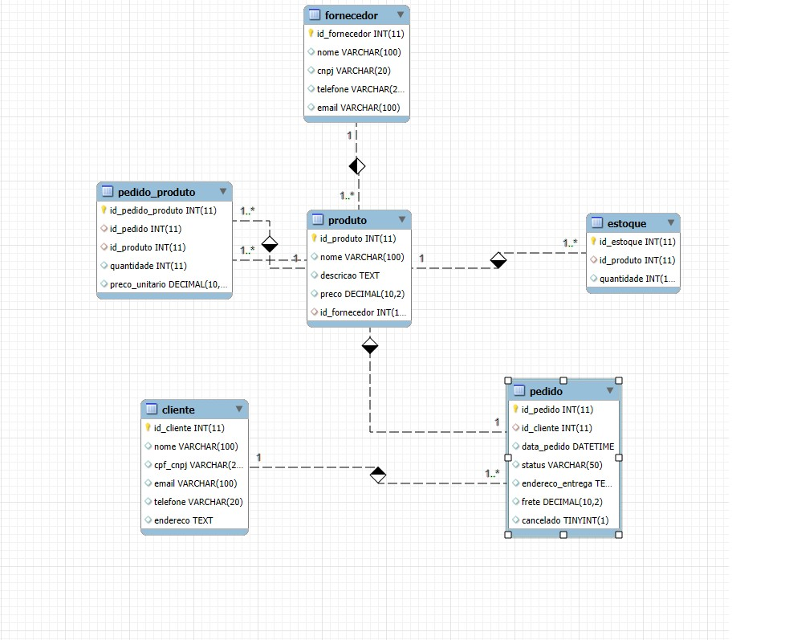

🛒 Projeto Banco de Dados - E-commerce
Este projeto simula a estrutura lógica de um banco de dados relacional para um sistema de e-commerce, contemplando criação de tabelas, inserção de dados e consultas SQL complexas. Foi desenvolvido como parte do desafio de modelagem lógica da Digital Innovation One (DIO).

🎯 Objetivo
Modelar um banco de dados para um e-commerce com clientes PF e PJ.

Controlar produtos, fornecedores, estoque, pedidos, pagamentos e entregas.

Aplicar consultas SQL com filtros, agrupamentos, junções e ordenações.

🗃️ Estrutura do Banco de Dados
O banco de dados contempla as seguintes entidades e relacionamentos:

Entidade	Descrição
Cliente	Clientes Pessoa Física (PF) e Jurídica (PJ)
Fornecedor	Empresas fornecedoras de produtos
Vendedor	Pessoas responsáveis pelas vendas
Produto	Produtos vendidos
Estoque	Controle da quantidade de produtos
Pedido	Pedidos realizados pelos clientes
Pedido_Produto	Produtos dentro de um pedido
Pagamento	Formas e valores pagos
Entrega	Status e código de rastreamento da entrega

📁 Arquivos do Projeto
script_create.sql — Script para criação do banco de dados e todas as tabelas.

script_insert.sql — Script para inserção de dados de teste.

queries.sql — Consultas SQL com exemplos de recuperação e manipulação de dados.

README.md — Documentação do projeto.

🛠️ Tecnologias Utilizadas
MySQL Server

MySQL Workbench

Linguagem SQL

🚀 Como Executar Localmente
Abra o MySQL Workbench e conecte-se ao servidor.

Crie o banco de dados e as tabelas executando o script script_create.sql.

Insira os dados executando o script script_insert.sql.

Execute as consultas disponíveis no queries.sql para explorar os dados.

🔍 Exemplos de Consultas SQL
Quantidade de pedidos por cliente
sql
Copiar
Editar
SELECT c.mail, COUNT(p.id) AS total_pedidos
FROM cliente c
JOIN pedido p ON c.id = p.id_cliente
GROUP BY c.mail;
Vendedores que também são fornecedores
sql
Copiar
Editar
SELECT v.nome AS nome_vendedor, f.nome AS nome_fornecedor
FROM vendedor v
JOIN fornecedor f ON v.nome = f.nome;
Produtos, fornecedores e estoque disponível
sql
Copiar
Editar
SELECT p.nome AS produto, f.nome AS fornecedor, e.quantidade
FROM produto p
JOIN fornecedor f ON p.id_fornecedor = f.id
JOIN estoque e ON p.id = e.id_produto;
Valor total pago por cliente
sql
Copiar
Editar
SELECT c.mail, SUM(pg.valor) AS total_pago
FROM cliente c
JOIN pedido p ON c.id = p.id_cliente
JOIN pagamento pg ON p.id = pg.id_pedido
GROUP BY c.mail
HAVING total_pago > 0;
📸 Modelo Entidade-Relacionamento (ER)

📈 Possíveis Melhorias Futuras
Desenvolvimento de API REST para consumir esse banco.

Aplicação front-end para gerenciamento e visualização.

Relatórios dinâmicos e dashboards com ferramentas de BI.

👩‍💻 Sobre a Desenvolvedora
Tatiana Kami
LinkedIn | GitHub

## 🧠 Desenvolvido como parte do desafio de modelagem lógica da DIO.
